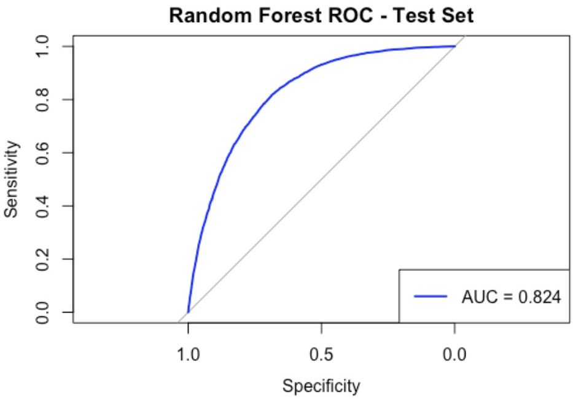
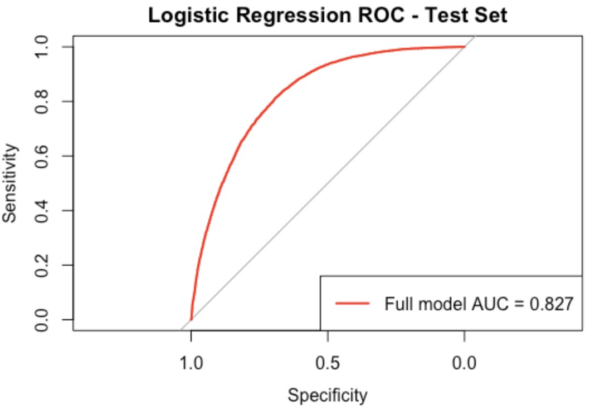
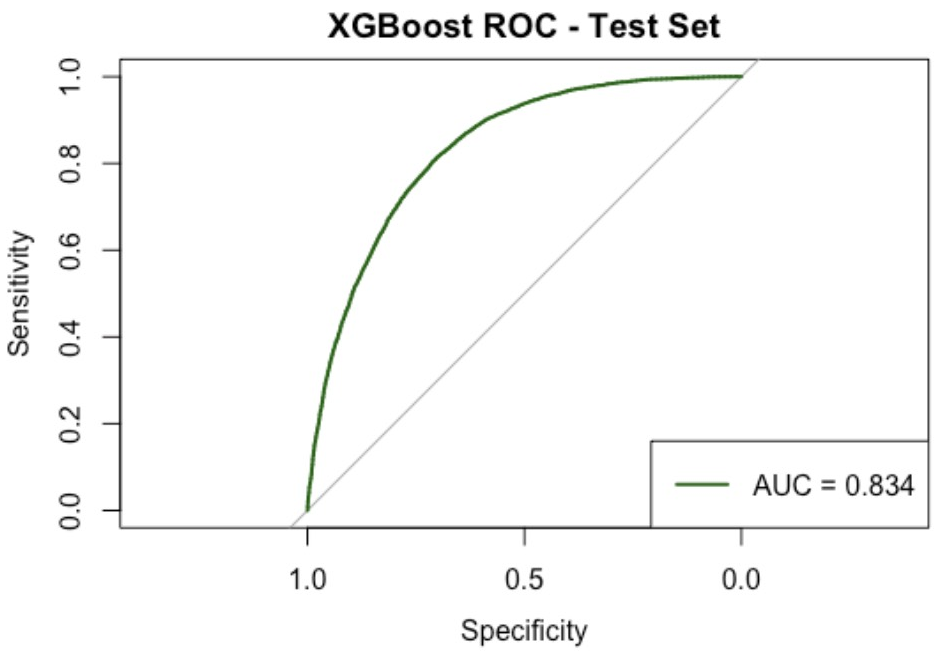
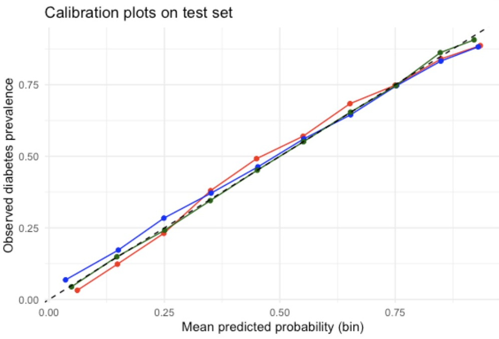

# Abstract

This project compared three models for predicting the risk of diabetes and prediabetes: logistic regression, random forest, and XGBoost. We used data from the 2015 BRFSS survey, which included 70,692 adults and 21 health-related questions. We split the data into two parts: 70% for training and 30% for testing. We used 5-fold cross-validation to test the stability of the models. All three models performed well. XGBoost had the highest AUC value (0.834). Logistic regression had a similar AUC value (0.827), and random forest had an AUC value of 0.824. The differences were small. Logistic regression was the easiest to understand and had the best specificity. We also built a simplified logistic regression model with fewer variables. Its performance was almost as good as the full model. Important predictors in all models included BMI, overall health status, age, and hypertension. Our study demonstrates that public health data can be helpful in predicting diabetes risk. Logistic regression is a good choice because it is easy to understand and performs well. These models can help identify high-risk individuals for targeted prevention programs.

# Introduction Section 

As the one of the most prevalent chronic diseases in the United States, diabetes is contributing to increased morbidity and healthcare costs. Although there is no cure, the progression of diabetes can often be mitigated when high risk individuals are identified before severe complications developed. Therefore, predictive models based on collected health information can be valuable tools for public health officials and prevention efforts. 

The Behavioral Risk Factor Surveillance System (BRFSS), administered annually by the Centers for Disease Control and Prevention (CDC), is a health related telephone survey. For this project, we use a cleaned, balanced 2015 BRFSS dataset with 70,692 respondents, a binary outcome (no diabetes vs. prediabetes/diabetes; 50% per class), and 21 predictors. This project describes the development and comparison of logistic regression, random forest, and XGBoost models for diabetes risk prediction. It aims to assess whether or not more complex machine learning methods provide meaningful advantages over a simpler, interpretable logistic regression model in this dataset and  whether a reduced logistic regression model performs comparably to the full model selected by BIC.

# Method Section

- Training/Testing Set Split and Cross-Validation

We first split our dataset into training and testing sets. We used 70% of the data which is 49,486 respondents to train the model and the remaining 30% which is 21,206 respondents as the test set. This split ensures that we can fairly evaluate the model's performance on new data it has never seen during training.

After that, we further used 5-fold cross-validation on the training data to adjust model settings and prevent overfitting. This method works by randomly dividing the training set into 5 equally amount sized groups which are called "folds". Then, the model is trained 5 times independently, with 4 of the folds for training and the remaining fold for validation each time. This approch ensures that each data point in the training set is used for validation exactly once. Finally, the performance results from all 5 rounds are averaged to obtain a reliable estimate of the model's performance.

We applied this cross-validation process to compare different models and to selectively tune parameters. Therefore, the test set was not used at all during this stage. This ensures the data for testing was kept separate and only used for a final evaluation of our chosen model. This step helps make that the performance we report is realistic and not overly optimistic, and allows us to build a relatively accurate predictive model before testing it on truly unseen data.

- Logistic Regression 

Logistic regression is a statistical method designed for predicting binary outcomes by estimating the probability that an observation belongs to the positive class, which can then be converted into a 0/1 prediction using a chosen threshold.

We selected logistic regression for this project because it directly models diabetes risk and provides clear, interpretable estimates of how each predictor is associated with the outcome. This interpretability makes logistic regression a useful baseline model for understanding the effects of demographic, behavioral, and health-related variables and for comparison with more flexible methods such as Random Forest and XGBoost.

Although logistic regression does not automatically capture complex non-linear relationships, its simplicity leads to stable and transparent results, making it well suited as a reference model in our analysis.

- Stepwise model selection (BIC)

BIC is a model selection criterion that balances goodness-of-fit with model complexity by applying a stronger penalty for additional parameters; lower BIC values indicate a preferable trade-off between fit and simplicity. Starting from the full logistic regression model with all candidate predictors, we applied stepwise selection to iteratively add or remove predictors to minimize BIC.

- Random Forest

Random Forest is an ensemble method that builds many decision trees on random samples of the data and combines their predictions. By using multiple trees and random subsets of variables, it reduces overfitting, increases stability, and captures complex non‑linear patterns.

For our diabetes prediction project, we chose Random Forest because it handles mixed data types well and complements the interpretability of logistic regression. We trained a forest of 500 trees, setting mtry to √21 (the square root of our 21 predictors), which controls how many variables are considered at each split.

This randomness ensures trees are diverse and prevents any single strong predictor from dominating, allowing the model to learn from varied combinations of variables. As a result, Random Forest delivered strong and reliable performance in our analysis.

- XGboost

XGBoost is a tree based ensemble learning method that builds a strong predictor by sequentially adding many decision trees. Unlike Random Forest, which builds trees independently and averages their predictions, XGBoost trains each new tree to correct the errors made by the current set of trees. This boosting strategy often yields high predictive accuracy while controlling overfitting. We selected XGBoost because it can flexibly capture complex relationships, which may be missed by a standard logistic regression model.

# Result Section
{width=33%}
{width=33%}
{width=33%}

The ROC curves for each model visually confirm these findings. XGBoost showed the highest overall discriminative ability, with its curve positioned slightly above the others across most of the specificity range. All three models demonstrated strong classification performance, with AUC values exceeding 0.82.

{width=70%}

The performance of all three models on the test set is summarized in Table. XGBoost achieved the highest overall predictive performance with an AUC-ROC of 0.834, accuracy of 0.758, and sensitivity of 0.804. Logistic regression showed the highest specificity (0.727), indicating it was best at correctly identifying individuals without diabetes. Random forest performed comparably to the other models with an AUC-ROC of 0.824 and accuracy of 0.750.

{width=50%}

Calibration analysis revealed that all models produced well-calibrated probability estimates. The predicted probabilities closely aligned with observed event rates across the risk spectrum, with XGBoost showing slightly better calibration in the mid-to-high risk range. This indicates that the predicted probabilities from our models are reliable and could be meaningfully interpreted in clinical settings.

Nevertheless, the difference between AUC and ROC was not very large, but GLM had a significant advantage in terms of time efficiency and offered more feasibility for further research and analysis. Therefore, we chose GLM for more in-depth research and diagnostics to obtain a more efficient predictive model.

After selecting logistic regression as our modeling approach, we performed model selection and diagnostic analyses to identify a parsimonious set of predictors and to assess the adequacy and stability of the fitted model.

The full logistic regression model included all available demographic, behavioral, and health-related predictors in the BRFSS 2015 dataset. This model serves as a baseline with maximal flexibility but also the highest complexity.

- Model Selection

To obtain a more parsimonious model, stepwise model selection based on the Bayesian Information Criterion (BIC) was applied. Starting from the full model, predictors were iteratively added or removed using a bidirectional search, with the penalty term “BIC penalty = log(n)” where n is the number of training observations.
The final reduced model selected by BIC retained the following predictors:

Diabetes_binary ~ HighBP + HighChol + CholCheck + BMI + Stroke + 
    HeartDiseaseorAttack + HvyAlcoholConsump + GenHlth + PhysHlth + 
    DiffWalk + Sex + Age + Income
    
This reduced model balances interpretability and predictive performance by excluding variables that do not provide sufficient information once model complexity is penalized.

To assess the stability of BIC-based selection, the stepwise procedure was repeated within each fold of a 5-fold cross-validation on the training data. Variables such as Age, BMI, GenHlth, HighBP, and HighChol appeared consistently across folds, indicating robust importance, while less stable variables were excluded in multiple folds.
  
- Model Comparison

  - Cross-Validation Performance (Training Set): Using 5-fold cross-validation on the training data, the full and BIC-selected reduced models showed nearly identical predictive performance, with accuracy around 0.75 and AUC around 0.82 for both models. This indicates that BIC-based variable selection did not meaningfully reduce out-of-sample predictive performance.

  - Test Set Performance: On the test set, the full and BIC-selected reduced models achieved nearly identical accuracy (≈ 0.75) and AUC (≈ 0.83), with almost overlapping ROC curves, indicating comparable discriminative performance despite the reduced model using fewer predictors.

  - Likelihood Ratio Test: A likelihood ratio test comparing the reduced and full models was statistically significant (p < 0.05), indicating a slightly better fit for the full model in terms of deviance. However, this improvement did not translate into better predictive performance, as accuracy and AUC remained essentially unchanged. Given the large sample size, this statistically significant difference is likely of limited practical importance, and the reduced model is therefore preferred for its parsimony and interpretability.

- Diagnostic Analysis:

Model diagnostics were conducted on the reduced (BIC-selected) model to assess adequacy and influence. Deviance residuals vs fitted probabilities showed no strong systematic pattern, suggesting an adequate model fit. Leverage (hat values) identified a small number of observations with higher leverage; however, their proportion was low relative to the sample size. Cook’s distance indicated that no single observation exerted undue influence on the fitted model. DFBETAs for key predictors such as BMI and Age were examined, and no widespread instability in coefficient estimates was observed. Overall, diagnostic results indicate that the reduced logistic regression model is stable and not overly influenced by a small subset of observations.

# Conclusion Section

- Conclusion for method comparison

Overall, logistic regression, random forest, and XGBoost all demonstrated strong and comparable performance in predicting diabetes risk, with only modest differences in accuracy and AUC. While XGBoost achieved the highest AUC, the improvement over logistic regression and random forest was small. Logistic regression stood out for its interpretability, computational efficiency, and stable performance, making it particularly suitable for public health applications where understanding risk factors is important. These results suggest that, for this dataset, simpler and more interpretable models can perform nearly as well as more complex machine learning methods.

- Conclusion for further analysis of Logistic Regression:

In summary, BIC-based stepwise selection produced a reduced logistic regression model that achieves comparable predictive performance to the full model while using fewer predictors. Given its parsimony, interpretability, and stable diagnostics, the reduced model is preferred for diabetes risk prediction in this analysis.

- Discussion

Several limitations should be considered in our study. First, we used cross-sectional data, which means information was collected at one time point. This design shows links between factors and diabetes, but it cannot prove cause and effect or show how risk changes over time. Second, much of the data came from participants’ self-reports about their health behaviors and conditions. This may lead to recall bias, where people do not remember or report their health details accurately. Third, we grouped prediabetes and diabetes together. Although both show higher risk, they are different stages of the disease. Combining them might hide important differences in risk patterns. It is also possible that temporary conditions like gestational diabetes were included. Fourth, due to dataset limitations, some potentially important predictors were not available or not included in our analysis, such as family history of diabetes and other clinical or genetic risk factors. Omitting these variables may limit predictive performance and contribute to residual confounding.

Regarding methods, different models have different reproducibility. Logistic regression gives fixed results each time. But tree-based models like random forest and XGBoost include randomness during training. Even though this helps the model generalize better, results can vary a little unless we fix the random seed.

Our study also points to useful next steps. Combining predictions from logistic regression, random forest, and XGBoost could make performance better by using the strengths of each model. Also, using data collected over time would help us move beyond association and better understand how diabetes develops. Even with these limits, our work shows that public health data can be used to build helpful models to predict diabetes and prediabetes.

# References

Teboul, A. (2022). Diabetes Health Indicators Dataset. Kaggle. https://www.kaggle.com/datasets/alexteboul/diabetes-health-indicators-dataset

# Contribution
Shuchen Wu - Logistic Regression 

Tiantian Lian - XGBoost

Meiqi Zhu - Random Forest

https://github.com/Tiantian-Lian/625project.git