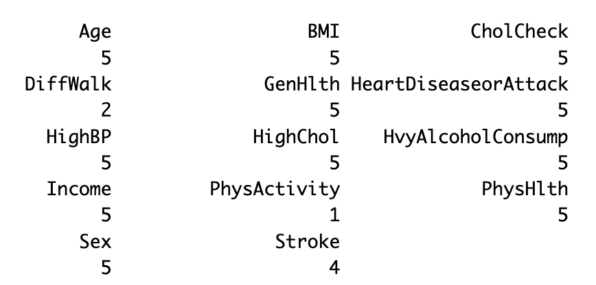

# Abstract/Summary

# Introduction Section 

As the one of the most prevalent chronic diseases in the United States, diabetes is contributing to increased morbidity, mortality, and healthcare costs. Although there is no cure, the progression and complications of diabetes can often be mitigated through some behaviors like weight management, healthy diet, regular physical activity, and appropriate medical treatment. Crucially, these strategies are most effective when high risk individuals are identified early, before severe complications developed. Therefore, predictive models based om collected health information for diabetes risk can be valuable tools for public health officials and prevention efforts.

The Behavioral Risk Factor Surveillance System (BRFSS), collected annually by the Centers for Disease Control and Prevention (CDC), is a health-related telephone survey.(that collects information on health behaviors, chronic conditions, and access to care in the adult population) For this project, we focus on a cleaned, balanced subset of the 2015 BRFSS data containing 70,692 respondents and a binary outcome indicating **no diabetes** versus **prediabetes or diabetes**, each class represents 50% of the sample.The dataset includes 21 predictors covering demographic characteristics (sex, age), socioeconomic indicators (education, income), lifestyle behaviors (smoking, physical activity, fruit consumption, vegetable consumption, heavy alcohol consumption), clinical conditions (high blood pressure, high cholesterol, stroke, heart disease, body mass index), healthcare access (health care coverage, cost-related barriers, cholesterol check), and self-reported health and functional status (general health, mental health,  physical health, difficulty walking).

The primary interest of this project is to build and compare predictive performance of logistic regression, random forest, and XGBoost for diabetes risk prediction using BRFSS 2015 health indicators. We train all models on a training set and evaluate them on a test set using a common set of metrics, (including ROC AUC, precision–recall AUC, classification performance at a chosen probability threshold, and calibration of predicted risks.???) A secondary objective is to identify and interpret the top predictors in prediction: we use penalized logistic regression to derive a reduced logistic model and compare its performance with the full model, (and we assess the consistency of important predictors identified by logistic regression, random forest, and XGBoost???). Through this comparison, we aim to understand whether complex machine learning methods provide meaningful advantages over a simpler, interpretable logistic model for diabetes risk prediction in large scaled data.

# Method Section

- Training/Testing Set Split and Cross-Validation

We first split our dataset into training and testing sets. We used 70% of the data which is 49,486 respondents to train the model and the remaining 30% which is 21,206 respondents as the test set. This split ensures that we can fairly evaluate the model's performance on new data it has never seen during training.

After that, we further used 5-fold cross-validation on the training data to adjust model settings and prevent overfitting. This method works by randomly dividing the training set into 5 equally amount sized groups which are called "folds". Then, the model is trained 5 times independently, with 4 of the folds for training and the remaining fold for validation each time. This approch ensures that each data point in the training set is used for validation exactly once. Finally, the performance results from all 5 rounds are averaged to obtain a reliable estimate of the model's performance.

We applied this cross-validation process to compare different models and to selectively tune parameters. Therefore, the test set was not used at all during this stage. This ensures the data for testing was kept separate and only used for a final evaluation of our chosen model. This step helps make that the performance we report is realistic and not overly optimistic, and allows us to build a relatively accurate predictive model before testing it on truly unseen data.

- Logistic Regression 

Logistic regression is a statistical method specifically designed to model and predict binary outcomes. Instead of directly predicting class labels, it estimates the probability that an observation belongs to the positive class, and these probabilities can then be converted into 0/1 predictions using a chosen threshold.
  
We selected logistic regression for our diabetes prediction project because it naturally fits the goal of predicting whether an individual has diabetes or not. The model directly outputs estimated diabetes risk, which makes the results easy to interpret and compare across individuals. In addition, logistic regression provides clear information about the direction and relative importance of each predictor, allowing us to understand how demographic, behavioral, and health-related variables contribute to diabetes risk.

Although logistic regression assumes a linear relationship between predictors and the log-odds of the outcome and therefore does not automatically capture complex non-linear patterns, this simplicity helps produce stable and transparent results. As a result, logistic regression serves as an interpretable baseline model that complements more flexible methods such as Random Forest and XGBoost.

  
- Random Forest

Random Forest is an ensemble learning method. It works by creating many decision trees, each trained on a random sample of the training data, and then combining their results for a final prediction. Using many trees instead of just one reduces overfitting and makes the predictions more stable. A key feature is that each tree is built using only a random subset of the predictor variables. This makes the trees different from each other, which improves the model’s ability to work well on new, unseen data. This design allows Random Forest to find complex and non-linear patterns in the data on its own.

For our diabetes prediction project, we selected Random Forest as a model because it works well with our mix of data types. We thought its strengths would be a good match with the straightforward interpretation of a logistic regression model. In our analysis, with a forest of 500 trees, an important setting we used is called mtry which decides how many different variables the algorithm can look at each time it makes a split in a tree. The common rule for classification is to set mtry equal to the square root of the total number of predictors. There are 21 predictor variables in our dataset then have mtry = √21, which is about 4.6. In practice, this means at every decision point, the model randomly picks about 5 of the 21 variables to consider.

Its randomness is useful for two main reasons. First, it helps make sure every tree in the "forest" is unique. If all trees looked at the same strongest variables every time, they would all be very similar and make the same mistakes. Second, it stops one very strong predictor from controlling every single tree. This forces the model to learn from different combinations of variables, helping it uncover more complex relationships. Therefore, the balance between random selection and finding good splits helped our Random Forest model achieve strong and reliable performance.

- XGboost

- 比较：
- Workflow: 选出 Logistic Regression， 然后做model selection 减少predictors，再和原来的Logistic Regression full model比较
- 遇到什么问题：Rcpp and parallel解决或者画图app？

# Result Section

- Performance Comparison:
  - Logistic Regression: AUC ≈ 0.827  
  - Random Forest: AUC ≈ 0.822  
  - XGBoost: AUC ≈ 0.831 
- Reduced Model:

Variable Importance:

# Conclusion Section
After selecting logistic regression as our modeling approach, we performed model selection and diagnostic analyses to identify a parsimonious set of predictors and to assess the adequacy and stability of the fitted model.

The full logistic regression model included all available demographic, behavioral, and health-related predictors in the BRFSS 2015 dataset. This model serves as a baseline with maximal flexibility but also the highest complexity.

- Model Selection
To obtain a more parsimonious model, stepwise model selection based on the Bayesian Information Criterion (BIC) was applied. Starting from the full model, predictors were iteratively added or removed using a bidirectional search, with the penalty term
BIC penalty = log(n)
where n is the number of training observations.
The final reduced model selected by BIC retained the following predictors:
Diabetes_binary ~ HighBP + HighChol + CholCheck + BMI + Stroke + 
    HeartDiseaseorAttack + HvyAlcoholConsump + GenHlth + PhysHlth + 
    DiffWalk + Sex + Age + Income
This reduced model balances interpretability and predictive performance by excluding variables that do not provide sufficient information once model complexity is penalized.

To assess the stability of BIC-based selection, the stepwise procedure was repeated within each fold of a 5-fold cross-validation on the training data. Variables such as Age, BMI, GenHlth, HighBP, and HighChol appeared consistently across folds, indicating robust importance, while less stable variables were excluded in multiple folds.
{width=50%}

- Model Comparison
Cross-Validation Performance (Training Set): 
Using 5-fold cross-validation on the training data, the full and reduced models exhibited nearly identical predictive performance:
Accuracy: approximately 0.75 for both models
AUC: approximately 0.82 for both models
This suggests that removing predictors via BIC-based selection did not materially degrade predictive accuracy.

Test Set Performance:
Both models were refit on the entire training set and evaluated on the held-out test set. Results show:
Accuracy:
Full model ≈ 0.749
Reduced (BIC) model ≈ 0.749
AUC:
Full model ≈ 0.827
Reduced model ≈ 0.827
The ROC curves for the two models are nearly indistinguishable, indicating equivalent discriminative ability.
{width=50%}

Likelihood Ratio Test:
A likelihood ratio test comparing the reduced model to the full model yielded a statistically significant result (p < 0.05), suggesting that the full model provides a slightly better fit in terms of deviance. However, this improvement is not reflected in predictive performance, as accuracy and AUC remain unchanged.
Given the large sample size, small differences in deviance can become statistically significant without being practically meaningful. Therefore, the reduced model is preferred due to its parsimony and interpretability.

Diagnostic Analysis:
Model diagnostics were conducted on the reduced (BIC-selected) model to assess adequacy and influence.
{width=50%}

Deviance residuals vs fitted probabilities showed no strong systematic pattern, suggesting an adequate model fit.

Leverage (hat values) identified a small number of observations with higher leverage; however, their proportion was low relative to the sample size.
Cook’s distance indicated that no single observation exerted undue influence on the fitted model.
DFBETAs for key predictors such as BMI and Age were examined, and no widespread instability in coefficient estimates was observed.
Overall, diagnostic results indicate that the reduced logistic regression model is stable and not overly influenced by a small subset of observations.

- Conclusion:
In summary, BIC-based stepwise selection produced a reduced logistic regression model that achieves comparable predictive performance to the full model while using fewer predictors. Given its parsimony, interpretability, and stable diagnostics, the reduced model is preferred for diabetes risk prediction in this analysis.

- Discussion

Several limitations should be considered in our study. First, we used cross-sectional data, which means information was collected at one time point. This design shows links between factors and diabetes, but it cannot prove cause and effect or show how risk changes over time. Second, much of the data came from participants’ self-reports about their health behaviors and conditions. This may lead to recall bias, where people do not remember or report their health details accurately. Third, we grouped prediabetes and diabetes together. Although both show higher risk, they are different stages of the disease. Combining them might hide important differences in risk patterns. It is also possible that temporary conditions like gestational diabetes were included.

Regarding methods, different models have different reproducibility. Logistic regression gives fixed results each time. But tree-based models like random forest and XGBoost include randomness during training. Even though this helps the model generalize better, results can vary a little unless we fix the random seed.

Our study also points to useful next steps. Combining predictions from logistic regression, random forest, and XGBoost could make performance better by using the strengths of each model. Also, using data collected over time would help us move beyond association and better understand how diabetes develops.

Even with these limits, our work shows that public health data can be used to build helpful models to predict diabetes and prediabetes.

# References

National Institute of Diabetes and Digestive and Kidney Diseases (NIDDK). (2016). Risk factors for type 2 diabetes. U.S.
Department of Health and Human Services.
https://www.niddk.nih.gov/health-information/diabetes/overview/risk-factors-type-2-diabetes
Abdullah, A., Peeters, A., de Courten, M., & Stoelwinder, J. (2010). The magnitude of association between overweight and
obesity and the risk of diabetes: a meta-analysis of prospective cohort studies. Diabetes research and clinical practice, 89(3),
309–319. https://doi.org/10.1016/j.diabres.2010.04.012
Gress, T. W., Nieto, F. J., Shahar, E., Wofford, M. R., & Brancati, F. L. (2000). Hypertension and antihypertensive therapy as risk
factors for type 2 diabetes mellitus. Atherosclerosis Risk in Communities Study. The New England journal of medicine, 342(13),
905–912. https://doi.org/10.1056/NEJM200003303421301
Lipscombe, L. L., Austin, P. C., Manuel, D. G., Shah, B. R., Hux, J. E., & Booth, G. L. (2010). Income-related differences in
mortality among people with diabetes mellitus. CMAJ : Canadian Medical Association journal = journal de l'Association medicale
canadienne, 182(1), E1–E17. https://doi.org/10.1503/cmaj.090495
Stringhini, S., Sabia, S., Shipley, M., Brunner, E., Nabi, H., Kivimaki, M., & Singh-Manoux, A. (2010). Association of
socioeconomic position with health behaviors and mortality. JAMA, 303(12), 1159–1166. https://doi.org/10.1001/jama.2010.297
Cornier, M.-A., Donahoo, W. T., Gurgevich, J. E., et al. (2008). The metabolic syndrome.
https://pages.ucsd.edu/~mboyle/COGS163/pdf-files/The-Metabolic-Syndrome-Cornier-Endocrine-Reviews-2008.pdf

ˆ The contributions from each of the group member should be clearly stated (although all the
students in a group will receive equal points for the final group project).
ˆ A public GitHub repository should be used for the group members to collaborate on the final
project, with a link to it provided in the report.
ˆ Graphics (ideally with ggplot2) should be used to present the results
